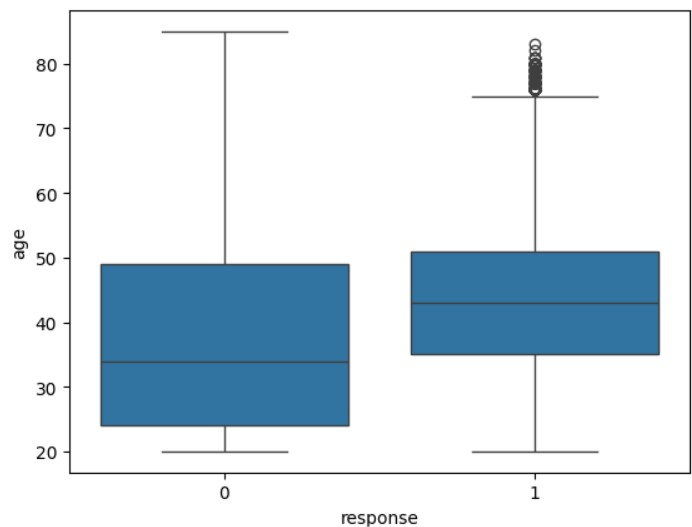
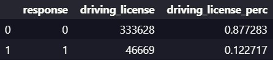
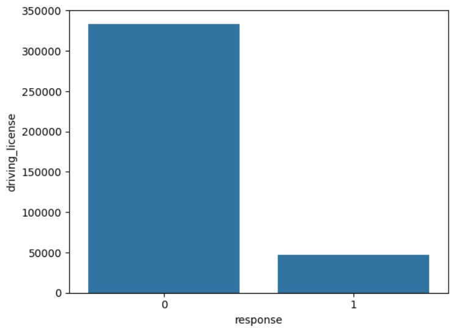
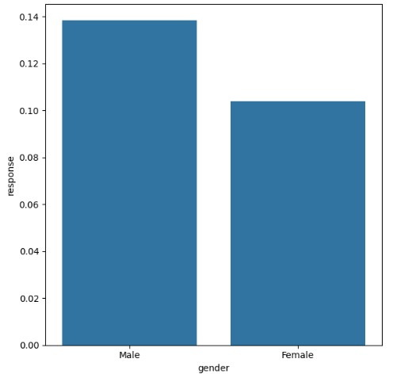
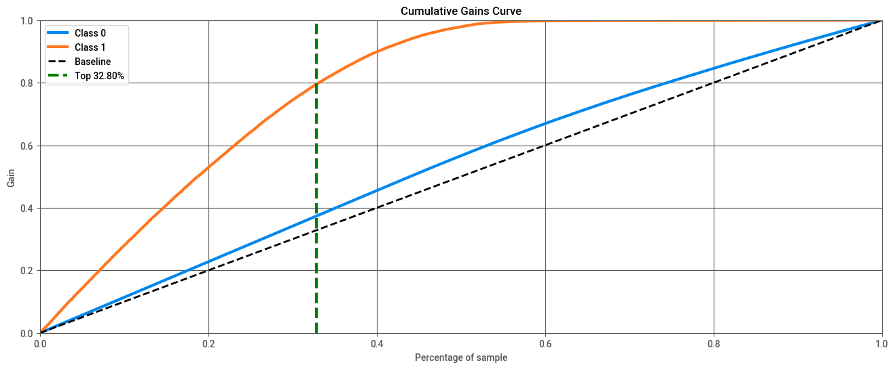
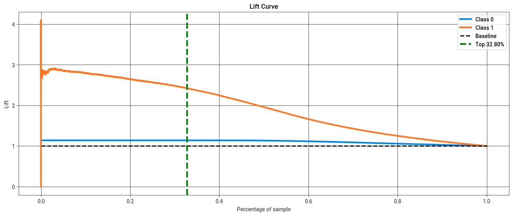

# Health Insurance Cross-Sell

## Este projeto tem como objetivo ranquear uma lista de clientes em potencial com base na probabilidade de comprarem seguro de carro, usando um score de propensão.

# 1. Problema de Negócio

O conjunto de dados é de uma empresa de seguros que já oferece seguro saúde aos seus clientes. O objetivo é prever quais clientes têm maior probabilidade de comprar seguro de carro, organizando-os em um ranking.

Isso permitirá que a equipe de vendas concentre seus esforços nos clientes mais promissores, otimizando recursos e aumentando a receita em comparação com uma abordagem aleatória.

# 2. Premissas de Negócio

- Os dados são desbalanceados, com uma proporção significativamente menor de clientes interessados em seguro de carro.
- Cada apólice de seguro de carro gera uma receita média de US$ 1.000 por cliente.
- Um ranking eficiente aumenta as chances de conversão e reduz os custos de aquisição de clientes.

# 3. Estratégia da Solução

Minha estratégia para resolver este desafio foi:

**Etapa 01. Descrição dos Dados:**

Análise inicial dos dados fornecidos pela empresa, incluindo a distribuição das variáveis e a identificação de valores ausentes.

**Etapa 02. Engenharia de Atributos:**

Criação e transformação de variáveis relevantes para aumentar o poder preditivo do modelo.

**Etapa 03. Filtragem dos Dados:**

Remoção de outliers e tratamento de inconsistências nos dados.

**Etapa 04. Análise Exploratória dos Dados:**

Identificação de relações entre variáveis e compreensão dos padrões de comportamento dos clientes.

**Etapa 05. Preparação dos Dados:**

Normalização, codificação de variáveis categóricas e divisão dos dados em conjuntos de treino e teste.

**Etapa 06. Seleção de Atributos:**

Identificação das variáveis mais importantes para o desempenho do modelo.

**Etapa 07. Modelagem de Machine Learning:**

Treinamento de modelos de machine learning para prever a probabilidade de compra de seguro de carro.

**Etapa 08. Validação Cruzada:**

Implementação de validação cruzada com 5 folds e amostragem estratificada para manter a distribuição das classes entre os folds.

**Etapa 09. Conversão da Performance do Modelo em Valores de Negócio:**

Conversão dos resultados do modelo em insights tangíveis, como aumento esperado de receita.

# 4. Top 3 Insights dos Dados

- Grande parte da probabilidade de compra de seguro de veículo está entre clientes com idade entre 35 e 50 anos.

- Há muitas pessoas com carteira de motorista que não desejam seguro de carro.

- 14% dos homens e 10% das mulheres comprariam um seguro de veículo.

# 5. Modelo de Machine Learning Aplicado

O principal modelo utilizado foi o XGBoost, que apresentou excelente desempenho na classificação de clientes em potencial. Modelos adicionais, como Random Forest e KNN, também foram testados para comparação.

# 6. Performance do Modelo de Machine Learning

- **Recall at K médio:** 79,48%

# 7. Resultados de Negócio

Os resultados mostram que o modelo é eficaz em ranquear clientes, aumentando significativamente a conversão em comparação com uma abordagem aleatória.

- 33% da base de clientes, ordenada pela probabilidade de compra, contém 80% de todos os interessados em adquirir seguro de veículo.
- Isso corresponde a 20 mil ligações realizadas pela equipe de vendas.
- O modelo proposto é 2,5 vezes melhor do que uma escolha aleatória.
- Se considerarmos US$ 1.000 por seguro, este modelo alcançará aproximadamente US$ 26 milhões a mais em receita do que uma escolha aleatória.

# 8. Conclusões

O projeto demonstrou que o uso de machine learning pode transformar um processo tradicional de vendas, trazendo ganhos significativos de eficiência e receita. O ranking gerado permite que a equipe de vendas foque nos clientes com maior probabilidade de conversão, otimizando esforços e aumentando o ROI.

# 9. Lições Aprendidas

- A validação cruzada é importante para a eficácia do modelo.
- Traduzir resultados técnicos em insights de negócio é essencial para o sucesso do projeto.
- A integração entre equipes técnicas e comerciais é crucial para gerar impacto no negócio.

# 10. Próximos Passos para Melhorar

- Tratar dados desbalanceados para evitar vieses no modelo.
- Criar um ranking final para a equipe de vendas e implantar a solução em produção.
- Desenvolver um dashboard interativo para que a equipe de vendas acompanhe os resultados em tempo real.
